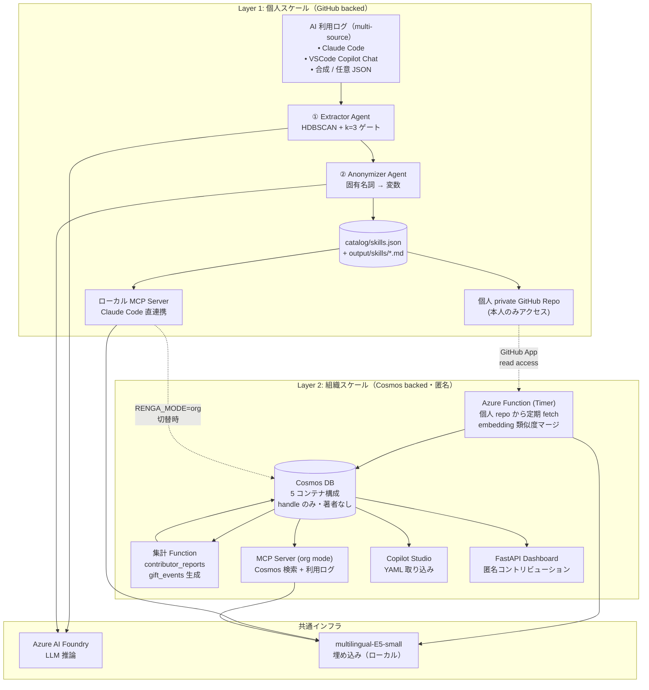
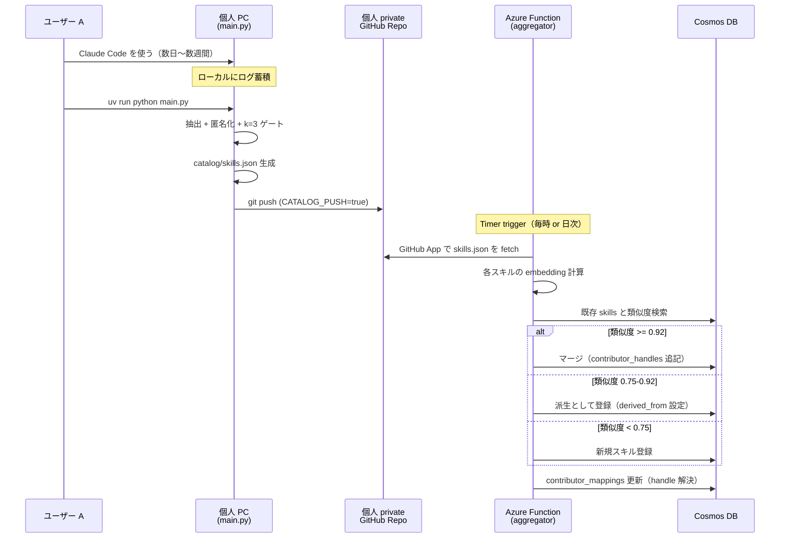
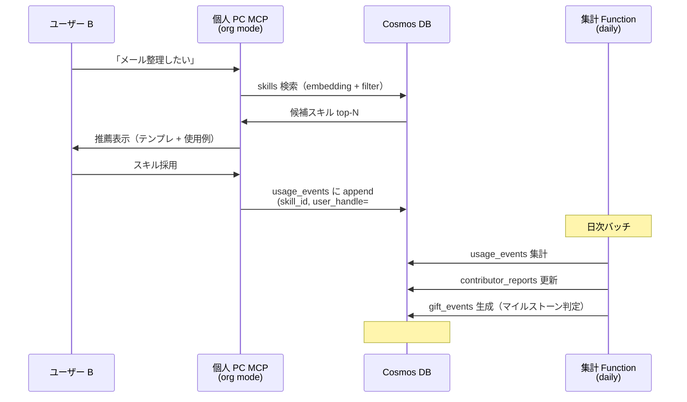

# アーキテクチャ図

Zenn 記事埋め込み用。Mermaid と説明文のセット。

本システムは **個人スケール (Layer 1) と組織スケール (Layer 2) のなめらかな移行** を
コア設計とする。個人は Layer 1 だけで完結し、組織導入時に Layer 2 が加算される。

---

## システム全体図

### モード切替

`RENGA_MODE` 環境変数で個人完結 / 組織連携を切り替える。

| `RENGA_MODE` | 動作 |
|---|---|
| `personal`（既定）| Layer 1 のみ。ローカル catalog/skills.json を MCP / Copilot から参照 |
| `org` | Layer 2 接続。MCP / Copilot は Cosmos から検索、利用ログを Cosmos に送信 |

---

## データフロー詳細

### スキル登録フロー（個人 → 中央）

### 利用フロー（中央 → 個人 + 集計）

---

## 匿名性の保証

### 脅威モデル

| 攻撃者 | アクセス可能なもの | 匿名性 |
|---|---|---|
| 一般社員 | Cosmos の `skills` コンテナ（handle のみ）| ✅ 保たれる |
| 一般社員 | 他人の private repo | ✅ 読めない |
| 一般社員 | 自分の private repo | ⚠️ 自分のみ可視 |
| IT 管理者 | Cosmos 全件 + 全 private repo + mappings | ❌ 復号可能（設計上許容）|

### 重要な実装ガード

- **個人 repo は private 必須**: README 警告 + `gh api repos/{owner}/{repo}` で起動時チェック
- **Azure Function は GitHub App として認証**: PAT を渡さない（最小権限）
- **`contributor_mappings` は管理者 RBAC**: Cosmos DB Built-in Data Reader 以上が必要
- **個人 PC は Cosmos に対して**:
  - `skills` / `contributor_reports`: **read-only**
  - `usage_events`: **append-only**（自分の handle に対してのみ）
  - `contributor_mappings`: アクセス不可

### 「個人には匿名・システムには記憶される」非対称性

設計記事の核となる原則:

> 1. **可視化すると見返り狙いが混入する**（顕示的になる）
> 2. **完全匿名だと文化として残らない**（ハーディンの公共財ジレンマ）
>
> → 「個人には匿名・システムには記憶される」非対称性で解く

実装での具体:
- 公開面（Cosmos）: handle のみ → 一般社員からは個人特定不可
- 内部記録（contributor_mappings）: 評価面談用に管理者は復号可能
- 本人通知（gift_events）: 本人だけが自分の handle で照会可能

---

## Microsoft スタック対応表

| コンポーネント | 技術 | 必須/推奨 |
|---|---|---|
| ユーザー UI | **Copilot Studio**（生成YAMLをインポート） | 必須要件クリア |
| LLM | **Azure AI Foundry**（DeepSeek-V4-Flash） | 必須要件クリア |
| 集約処理基盤 | **Azure Functions**（Timer + Aggregator） | 必須要件・加点 |
| スキルカタログ（中央） | **Azure Cosmos DB**（5 コンテナ） | 推奨技術への加点 |
| ソースコード・個人 repo | **GitHub** + **GitHub App** | 推奨技術への加点 |
| セマンティック検索 | multilingual-E5-small（ローカル）+ Cosmos クエリ | — |
| クラスタリング | HDBSCAN + UMAP | — |
| 個人エージェント | 自前 ReAct パイプライン（main.py） | — |
| 追加配信路 | **MCP Server**（Claude Code 連携・mode 切替対応） | 拡張機能 |

---

## 設計上の選択

- **Layer 1 単体で完結可能**: Cosmos DB 不要でも個人レベルの価値が出る。組織導入のハードルを下げる
- **Layer 2 は加算的**: Cosmos を追加すると複数人で共有可能になる。導入順序がなめらか
- **GitHub を経由する理由**: Function が pull 型で動けば、push 認証や API レート制限の問題が消える。個人 repo を「バックアップ」として残せる
- **個人 repo を private 必須にする理由**: 公開 repo は git log で著者が暴露される。private なら本人と Function（GitHub App）のみがアクセス
- **Cosmos DB を採用する理由**: 中央集約時に複数 writer の衝突がない（Function が唯一の writer）、handle ベースクエリが高速、コンテナ単位の RBAC で機微情報の保護が可能
- **Azure Functions を採用する理由**: Timer trigger で pull 型集約、HTTP trigger で usage_events 受信、両方を1つのリソースで賄える
- **MCP サーバを追加した理由**: Microsoft Copilot Studio 経由に加えて、Claude Code ユーザーが直接スキルを検索・取得できる経路を提供する。スキル抽出元と配信先が同じになることで、利用ログ → スキル化 → 再利用のループが閉じる

---

## 段階的実装計画

| 段階 | Layer 1 | Layer 2 |
|---|---|---|
| ✅ **完了** | Extractor / Anonymizer / k=3 / ローカル MCP / `CATALOG_PUSH` | — |
| **MVP**（必須）| — | Cosmos スキーマ作成 + aggregator Function（fetch → dedupe → write）|
| **β** | mode 切替（`RENGA_MODE=org`）| usage_events 書込 API + 個人 MCP の org mode 読込 |
| **γ** | — | contributor_reports 集計 Function（日次）|
| **δ**（任意）| — | gift_events 生成 + 系統樹クレジット分配 + クロスチーム加重 |

詳細スキーマは `db_schema.md` を参照。
