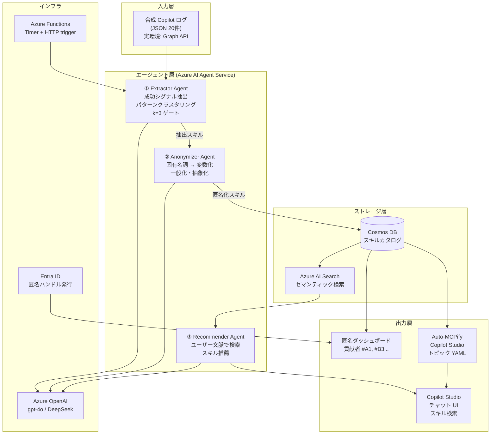
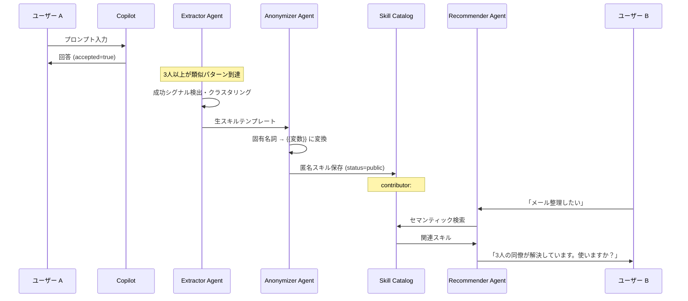

# アーキテクチャ図

Zenn 記事埋め込み用。Mermaid と説明文のセット。

## システム全体図

## データフロー詳細

## Microsoft スタック対応表

| コンポーネント | 技術 | 必須/推奨 |
|---|---|---|
| エージェント実行 | Azure AI Agent Service | 必須（Agentic 評価の主軸） |
| LLM | Azure OpenAI gpt-4o / DeepSeek | 必須 |
| スキルカタログ | **Azure Cosmos DB** | 推奨技術（加点） |
| セマンティック検索 | Azure AI Search | 必須（スキル発見） |
| 実行基盤 | **Azure Functions** HTTP+Timer | 必須要件クリア |
| ユーザー UI | **Copilot Studio** | 必須要件クリア |
| 認証 | **Microsoft Entra ID** | 推奨技術（加点） |
| CI/CD | **GitHub / GitHub Copilot** | 推奨技術（加点） |
